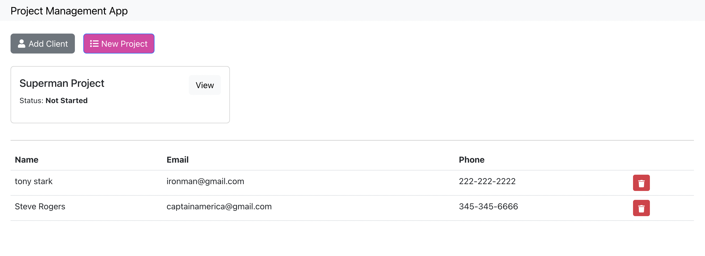

# project management app
this app is basically a way to manage the life cycle of a project. 

  
 

## setting up in local
- npm i in `root` and `client` folder after cloning the app
- setup a `DB` in mongodb
- add a `.env` with `PORT` , `NODE_ENV` and the `MONGO_URI` variables
- run the scripts as mentioned in `package.json`

